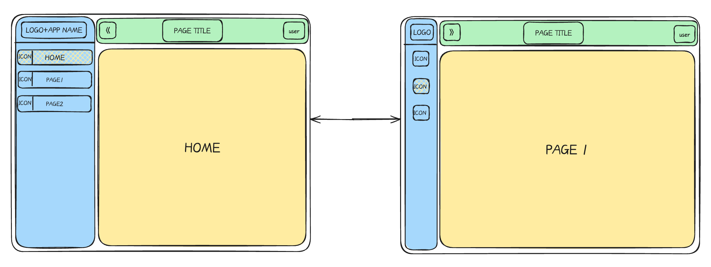

# HowToLearn-WebDev

## HowTOUse

```sh
npm install
npm run dev
npm run build
```

## Commit

- HTML+CSS+JS:

  1.  基于 vite 使用 tinybase 模板创建项目：npx tiged tinyplex/vite-tinybase HowToLearn-WebDev：

      - 依赖安装：npm i
      - 启动项目：npm run dev

  2.  使用 ChatGPT 依据如下布局生成基础代码：

      - 

  3.  熟悉代码增加注释，关键知识点：

      - index.html：基础 HTML 结构；
      - src/index.js：功能实现代码；
      - src/index.css：CSS 样式表；

  4.  调整侧边栏效果：

      - 显示 LOGO + APP NAME
      - 调整展开缩放时 ICON 显示不完全
      - 修复箭头缩放后不会改变
      - 改变侧边栏子项选择后的背景色，以及 padding，手动调试每项改动可以学习盒子模型

  5.  动态加载其他 html 页面代码。

- VUE:

  1.  使用 vue 重新创建项目。

  2.  移植基础环境组件。

  3.  增加页面切换功能。

  4.  通过数据绑定实现侧边栏伸缩。

  5.  使用 Router 实现页面切换。

  6.  使用 pinia 保存数据。

  7.  侧边栏使用 Element-Plus 实现。
